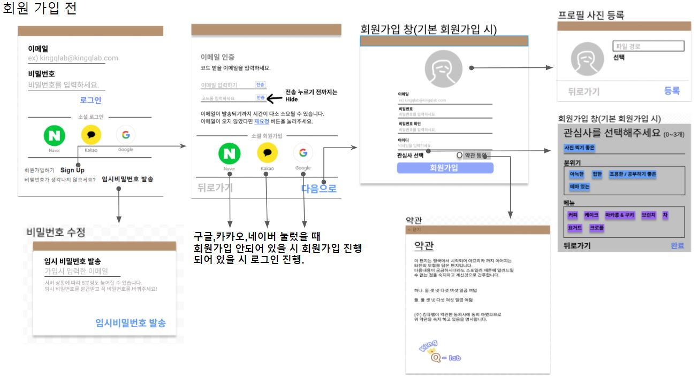
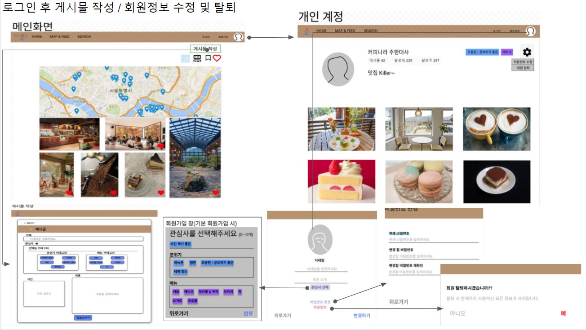
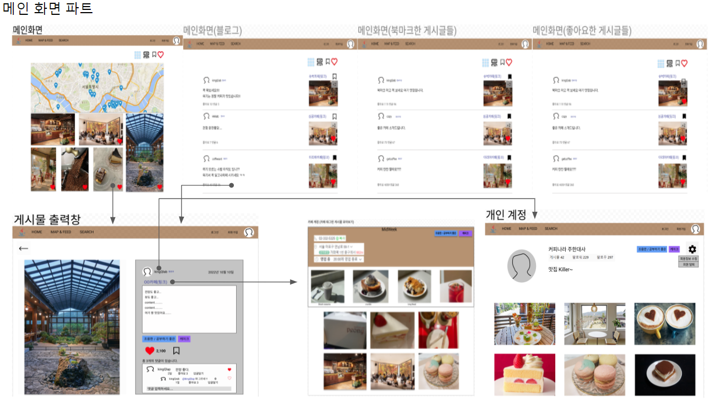
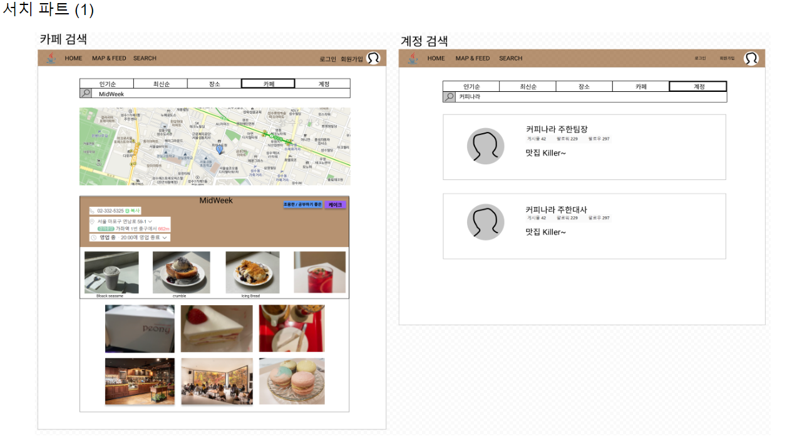
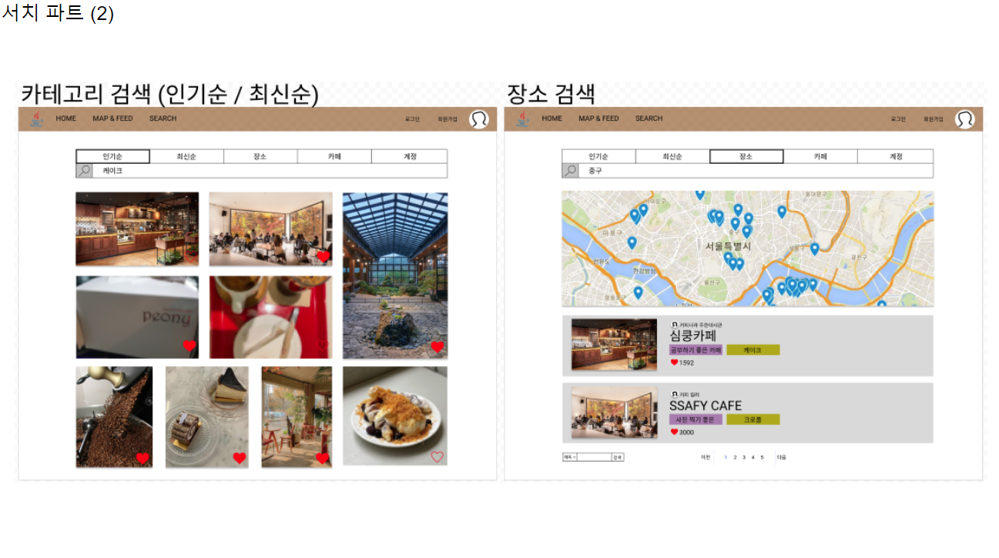
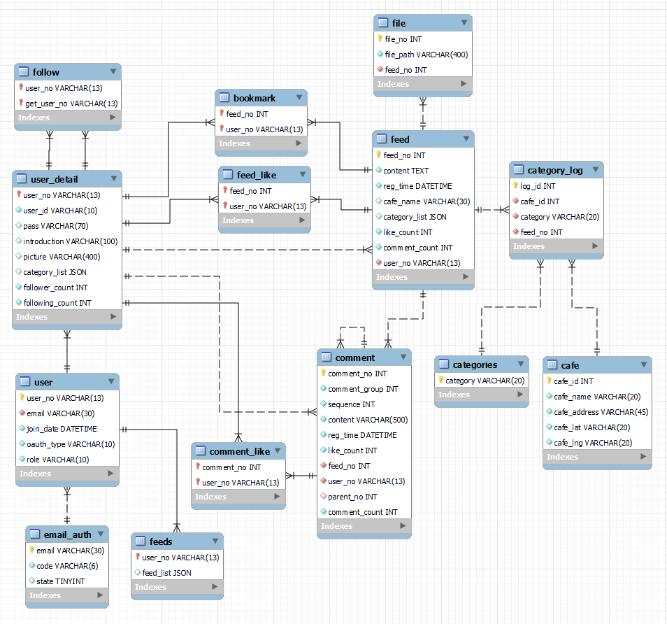

<!-- 필수 항목 -->

## 카테고리

| Application | Domain | Language | Framework |
| ---- | ---- | ---- | ---- |
| :white_check_mark: Desktop Web | :black_square_button: AI | :white_check_mark: JavaScript | :black_square_button: Vue.js |
| :white_check_mark: Mobile Web | :black_square_button: Big Data | :black_square_button: Html | :white_check_mark: React |
| :white_check_mark: Responsive Web | :black_square_button: Blockchain | :black_square_button: C/C++ | :black_square_button: Angular |
| :black_square_button: Android App | :black_square_button: IoT | :black_square_button: C# | :black_square_button: Node.js |
| :black_square_button: iOS App | :black_square_button: AR/VR/Metaverse | :black_square_button: Python | :black_square_button: Flask/Django |
| :black_square_button: Desktop App | :black_square_button: Game | :white_check_mark: Java | :white_check_mark: Spring/Springboot |
| | | :black_square_button: Kotlin | |

<!-- 필수 항목 -->

## 프로젝트 소개

* 프로젝트명: 카페(디저트) 큐레이션 기반 SNS
* 서비스 특징: 웹/모바일(웹 디자인) 스켈레톤 프로젝트
* 주요 기능
  - 회원 관리
  - 관심사로 등록된 피드 확인
  - SNS 기능 (피드, 팔로우/언팔로우, 댓글, 좋아요)
  - 지도를 통한 점포 가독성
* 주요 기술
  - JPA
  - React
  - JWT Authentication
  - REST API
* 참조 리소스
* 배포 환경
  - URL: 
  - 테스트 계정: 

<!-- 자유 양식 -->

## 팀 소개
* 박주한: 팀장, 프론트엔드 개발
* 이승현: 부팀장, 백엔드 개발
* 박소희: 백엔드 개발 
* 서은민: 백엔드 개발
* 정동균: 프론트엔드 개발
* 유병재: 프론트엔드 개발

<!-- 자유 양식 -->

## 프로젝트 상세 설명
### 기획 
- **회원 가입**
  - **자체 회원가입**
    - 회원은 이메일을 입력후 이메일 인증을 한다.
    - 이메일 중복 불가 
    - 데이터 입력 후 이메일 인증 완료(이메일, 인증 코드를 서버에 넘겨서 코드가 일치해야함)
    - 이메일 인증이 완료 되면 추가 데이터(비밀번호, 아이디, 프로필 사진, 관심사)를 입력받는다.
      - 비밀번호는 영문+숫자+특수문자 모두 포함(최소 8자, 최대 15자)해야 한다.
      - 비밀번호 확인도 필요 (이중 확인)
      - 아이디 영문+숫자+특수문자(“_ , -, .”)(최소 4자, 최대 10자)(영문 or 숫자 필수 입력) 여야 한다.(중복 불가)
      - 프로필 사진을 등록하지 않으면 null이 입력된다. (null일 경우 기본 이미지 제공)
      - 관심사 카테고리 선택 (최소 0~3개 선택, 분위기/메뉴 상관없음)
      - 데이터 입력 후 회원 가입 완료

  - **SSO (OAuth. 네이버, 카카오, 구글 로그인)**
    - 소셜 회원가입 버튼을 누른다.
    - 해당 네이버,카카오,구글 아이디에서 받은 값을 이메일 값으로 회원가입한다.
    - 소셜 회원가입을 하면 아이디가 임의로 생성되어 가입된다.
    - 변경을 원할 시 회원 정보 수정을 이용하면 된다

     

- **로그인**
  - 이메일, 비밀번호 입력
  - 이메일 기억하기 기능 존재
  - 로그인 성공 시 access token과 refresh token이 발급되며, 로그인 이후 요청하는 모든 request의 헤더에 Bearer로 access token을 보내줘야함
  - access token 만료 시 access token과 refresh token을 서버에 보내서 토큰을 재발급 받아야함

     

- **비밀번호 찾기**
  - 자제 회원가입을 한 회원만 이용 가능하다.
  - 이메일 인증 후 임시 비밀번호 발급 후 로그인 후 비밀번호 변경

     

- **계정** 
  - 아이디, 게시물 수 , 팔로워, 팔로잉 수, 소개 , 프로필 사진, 관심사, 본인이 작성한 피드(메인 이미지만 최신순으로) 조회된다.
  - 로그인 하지 않았을 경우 위의 조회만 가능하다.
  - 로그인한 회원일 경우 팔로워 / 팔로잉 수 클릭시 각각의 목록이 조회된다.
    - 본인 계정일 경우
      - 팔로워 목록 
        - 아이디, 프로필 사진, 팔로잉 여부(true/false)
        - 팔로우 / 삭제 (상대방이 나의 계정 언팔로우 시키기) 가능
      - 팔로잉 목록 
        - 고유번호,아이디, 프로필 사진
        - 팔로우 / 언팔로우 
    - 다른 회원의 계정일 경우
      - 팔로워 / 팔로잉 목록 조회 시 아이디, 프로필 사진, 팔로잉 여부(true/false)가 조회된다.
      - 목록에 있는 회원 각각 팔로우 / 언팔로우 할 수 있다.
      - 다른 회원의 계정에서 해당 회원을 팔로우 / 언팔로우 할 수 있다. 
  - 로그인한 회원의 본인 계정일 경우
    - 본인의 프로필 상세 조회(아이디, 프로필 사진, 소개 , 이메일)가 가능하다.
    - 회원 정보 수정도 가능하다. 

     

- **회원정보 수정 / 탈퇴**
  - 아이디, 프로필 사진, 소개, 관심사 수정이 가능하다.
    - 아이디는 반드시 입력되어야 한다.
    - 아이디 영문+숫자+특수문자(“_ , -, .”)(최소 4자, 최대 10자)(영문 or 숫자 필수 입력) 여야 한다.(중복 불가)
    - 프로필 사진은 기본 프로필 사진으로도 변경이 가능하다.
    - 관심사 카테고리 선택 (최소 0~3개 선택, 분위기/메뉴 상관없음) 
  - 자체 회원가입을 한 회원은 비밀번호 변경이 가능하다.
    - 비밀번호는 영문+숫자+특수문자 모두 포함(최소 8자, 최대 15자)해야 한다.
    - 비밀번호 확인도 필요 (이중 확인)
  - 탈퇴

     

- **피드 - 상세보기**
  - 조회 : 파일, 작성자 프로필 사진, 아이디, 작성일, 내용, 카테고리, 카페명, 좋아요 수, 북마크 수, 댓글, 회원이 좋아요를 눌렀는지 여부
    - 좋아요 수 클릭시 좋아요를 누른 회원 목록 조회
    -   팔로우 목록 조회와 동일
        - 프로필 사진, 아이디, 팔로우 여부
        - 팔로우 / 언팔로우 가능
    - 작성자 클릭시 작성자 계정으로 이동
    - 카테고리 클릭시 검색 결과로 이동
    - 카페명 클릭시 카페 검색결과로 이동
  - 등록
    - 이미지, 작성자 고유 번호(로그인시 받은 고유 번호), 카테고리, 내용, 카페 명
      - 카페 정보와 카테고리는 선택
  - 삭제
    - 피드 고유번호, 작성자 고유 번호로 삭제
    - 댓글까지 삭제됨
  - 수정
    - 이미지 수정
      - 삭제된 이미지가 있을 경우 해당 이미지의 번호도 넘겨주어야 함
    - 내용 수정
    - 카테고리 수정
    - 카페 수정
  - 좋아요 / 좋아요 취소
  - 북마크 / 북마크 취소

     

* **댓글 (로그인한 회원만 사용 가능)**
  * 등록
    * 내용 작성 안 했을 시 등록 불가
  * 조회
    * 첫 번째 댓글
      * 작성자 프로필 사진, 작성자 아이디, 내용, 작성일, 좋아요 수, 로그인한 회원이 좋아요 눌렀는지에 대한 여부 조회
    * 대댓글
      * 첫 번째 댓글과 동일하나 부모 댓글 작성자의 아이디가 함께 조회
    * 좋아요 수 클릭시 좋아요를 누른 회원 목록 조회
      * 누른 회원의 프로필 사진, 아이디, 로그인한 회원이 해당 회원을 팔로우 했는지에 대한 여부 조회 
  * 삭제
    * 첫 번째 댓글 삭제 시 대댓글도 전부 삭제
    * 대댓글이 삭제됐을 시 해당 댓글만 삭제 
  * 좋아요 / 좋아요 취소
    * 빈 하트 클릭시 좋아요
    * 채워진 하트 클릭시 좋아요 취소
    
       

- **메인 화면**
  - 지도
    - 내 위치 기반으로 주변 카페 검색
    - 내 위치 제공 불허용 사용자일 경우 지도 초기 마커 기반으로 카페 검색
    - 지도에 표시된 카페 선택 시 토글 생성
      - 카페 정보 (카페 사진, 카페 이름, 카페 주소(위치). 메뉴 정보, 리뷰)
      - 카페 키워드
  - 피드
    - 이미지
      - 로그인 : 내가 선택한 카테고리 기반 + 내가 팔로우한 사람의 게시글 + 나의 게시글 최신순으로 조회
      - 그 외 : 랜덤으로 피드가 보여짐
        - 관심사, 팔로우한 사람, 내가 작성한 글 모두 없으면
        - 로그인을 하지 않았을 경우 등
      - 로그인 했을시 좋아요 / 좋아요 취소 가능 (여부 확인) - 로그인한 회원만 가능
      - 좋아요 수
    - 블로그
      - 프로필 사진, 아이디, 카페명, 내용, 이미지, 카테고리, 좋아요 수
      - 로그인 했을시 좋아요 / 좋아요 취소 가능 (여부 확인) - 로그인한 회원만 가능

     

* **검색 (로그인한 회원만 사용 가능)**
  * 검색창은 탭
  * 장소 검색
    * 검색 기반의 카페가 지도에 표시
    * 동 검색
      * 해당 동의 카페가 지도에 표시 및 해당 카페 목록이 노출
  * 카테고리 검색
    * 카테고리가 포함된 피드 목록 조회
    * 정렬 기준은 인기순 / 최신순
  * 카페 검색
    * 해당 카페의 위치가 지도에 표시
    * 카페의 상세 정보 확인 가능
    * 해당 카페가 등록된 피드 목록 조회  

- **북마크 목록**
  - 메인의 피드 화면과 동일

- **좋아요 목록**
  - 메인의 피드 화면과 동일

___

### 와이어프레임
   
  
  
  
  

### ERD 
  

___

### 참고사이트
* 백엔드

* 프론트엔드
  * 무한 스크롤 : https://ghur2002.medium.com/react%EC%97%90%EC%84%9C-infinite-scroll-%EA%B5%AC%ED%98%84%ED%95%98%EA%B8%B0-128d64ea24b5
  * 스켈레톤 컴포넌트 : https://ui.toast.com/weekly-pick/ko_20201110
  * axios, fetch : https://studyandwrite.tistory.com/368, https://dream-frontend.tistory.com/383
  * 게시판 기능 : https://www.youtube.com/watch?v=EDBYFsbjZ9I&list=PLEzWjQvavJSoI1gF7cP-uxFyJQD2l47O3&index=8&ab_channel=%EC%BD%94%EB%94%A9%EA%B2%AC%ED%9E%88%EC%B9%98HeechCoding
  * 
