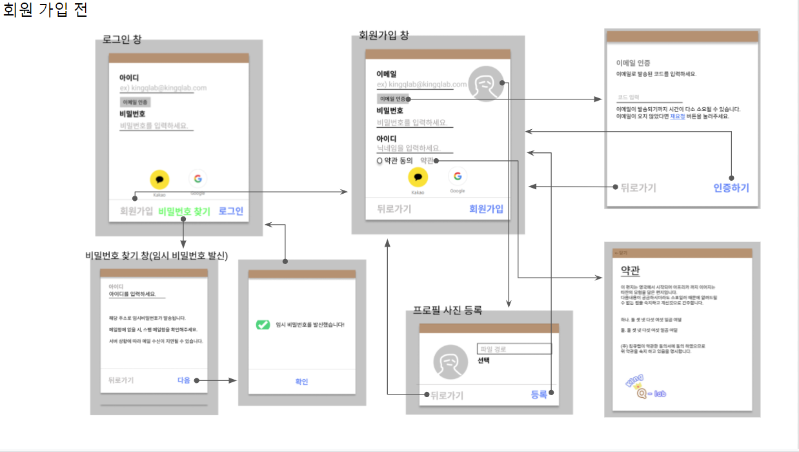
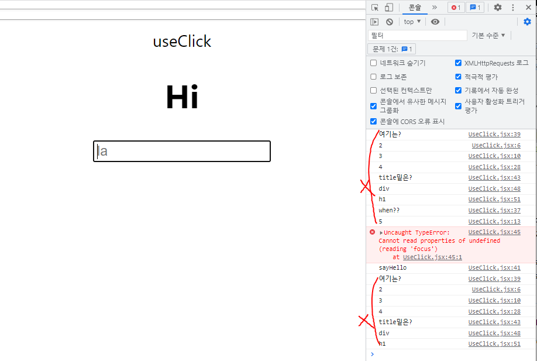
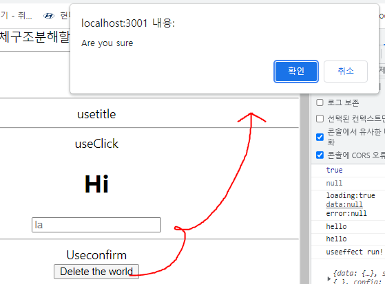
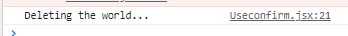
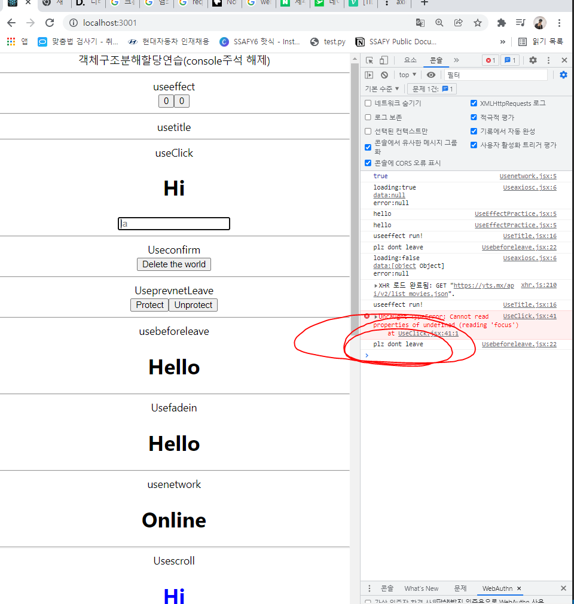
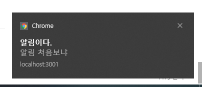
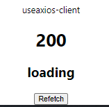
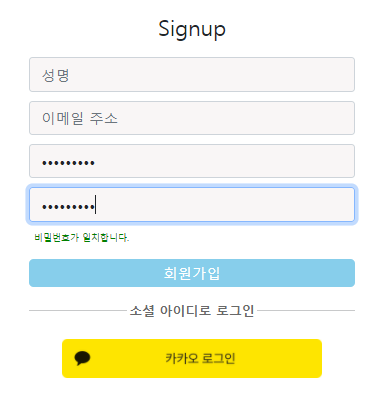

> ## ~ 01.10
>
> ## React(client)와 Django(server)를 이용한 개인 블로그 제작  [React 공부용]


## 1. react-router를 이용한 component link 구현.


```jsx
//client/src/App.js

import {BrowserRouter as Router, Route, Switch, Link} from 'react-router-dom'
// react-link 는 bootstrap Nav(자체적인 react link기능) 활용
import {Navbar, Container, Nav, NavDropdown} from 'react-bootstrap'

function App() {
  
  ...
  
  return (
    <div className="App">
      <header className="App-header">

        <Router>
        ...
            <Nav>
            	{/* State의 isLogin의 여부에 따라 content 표시 */}
                {
                  isLogin &&
                  <NavDropdown title="Blog" id="collasible-nav-dropdown">
                    <NavDropdown.Item href="/Community">개발 Blog</NavDropdown.Item>
                    <NavDropdown.Item href="/Myhamster">병순이 갤러리</NavDropdown.Item>
                    <NavDropdown.Item href="#">자유 게시판(Comming Soon)</NavDropdown.Item>
                  </NavDropdown>
                }
            </Nav>
            
            <Nav>
                {!isLogin && <Nav.Link href="/Login">Login</Nav.Link>}
                {!isLogin && <Nav.Link href="/Signup">Signup</Nav.Link>}
                {isLogin && <Nav.Link onClick={logout}>Logout</Nav.Link>}
            </Nav>
		...
          <Switch>
            <Route exact path="/"><Home/></Route>
            <Route path="/Community"><Community/></Route>
            <Route path="/Myhamster"><Hamster/></Route>
            <Route path="/Login"><Login loginCallBack={loginCallBack}/></Route>
            <Route path="/Signup"><Signup/></Route>
            <Route path="/CommunityNew"><CommunityNew/></Route>
            <Route path="/CommunityDetail/:pk" component={CommunityDetail}></Route>
          </Switch>
            
        </Router>
          
      </header>
    </div>
  );
}

export default App;

```


## 2. React-ckeditor를 활용한 게시판 글쓰기, 읽기, 미디어 업로드 구현.


##### client 에서 사진을 업로드하면,


##### media/uploads(hamster) 로 사진이 저장.


```jsx
//client/src/components/CommunityNew.js

import { CKEditor } from "@ckeditor/ckeditor5-react";
import ClassicEditor from "@ckeditor/ckeditor5-build-classic";

...

<CKEditor
            ...
    		onChange={(event, editor) => {
              ...
              // 에디터상 미리보기가 server측 상대경로로 저장되기 때문에, replace를 이용해 업로드한 					사진이 client측에서 보이게 함.
              const newData = data.replace(
                "src=\"/media",
                "src=\"http://ffe8-175-202-115-123.ngrok.io/media"
              );
			  ...
            }}
    		...
            config={{
              ckfinder: {
                uploadUrl: "http://ffe8-175-202-115-123.ngrok.io/ckeditor/upload/",
                options: {
                  resourceType: "Images",
                },
              },
            }}
/>
```


## 3. 좋아요 기능 구현.


```python
# server/hamster/views.py
...
@api_view(['POST'])
@permission_classes([AllowAny])
def like_user(request, hamster_pk):
    user_id = request.data['id']
    hamster = get_object_or_404(Hamster, pk=hamster_pk)
    likeUser = hamster.fans.all()
    if likeUser.filter(pk=user_id):
        hamster.fans.remove(user_id)
        liked = False
    else:
        hamster.fans.add(user_id)
        liked = True
    data = {
        'liked' : liked,
        'count' : hamster.fans.count()
    }
    return Response(data)
```


```jsx
//client/src/components/hamster.js

import axios from 'axios';
import jwt_decode from 'jwt-decode'

function Hamster() {
  ...
  const like = () => {
    const token = localStorage.getItem('jwt')
    var user = jwt_decode(token).user_id
    const url =  `http://ffe8-175-202-115-123.ngrok.io/hamster/like/${currentview}/`
    axios.post(url,{id:user},{headers:setToken()})
    .then(function(res){
      setIslike(res.data["liked"])
    })
  }
  ...
  return (
    <div className="Hamster">
      ...
      <Modal
        show={show}
        onHide={handleClose}
        backdrop="static"
        keyboard={false}>
        ...
        <Modal.Footer style={{display:'flex',justifyContent:'space-between'}}>
          <div>
            {islike && <p style={{cursor:"pointer", marginLeft:"30px"}} onClick={like}>❤</p>}
            {!islike && <p style={{cursor:"pointer", marginLeft:"30px"}} onClick={like}>🤍</p>}
          </div>
          <Button style={{marginRight:"30px"}} variant="secondary" onClick={handleClose}>Close</Button>
        </Modal.Footer>
      </Modal>
    </div>
  );
}

export default Hamster;

```


## 느낀점

#### 1. javascript 문법과 유사해 적응하는데 어렵지 않았다.

### 2. 하지만 막상 ngrok터널을 이용해 외부에서 돌려보니 속도측에서 아쉬웠고, 프론트와 백에서의 구현 최적화가 얼마나 중요한지 느꼈다. (지금까진 local에서만 돌려봐서 못느꼈는데  속도가 이렇게 느릴 줄 몰랐다.)

### 3. 리액트 hook을 자유자재로 사용할 수 있는 능력이 생길때까지 열심히 학습하겠다.


> ## 01.10
>
> ## 와이어프레임 제작 (figma)이용.





## 느낀점

### 1. 1학기때 프로젝트 할때는 이렇게 기획단계를 거친 적이 없었던거같다.

### 2. 기획단계를 거치며 프로젝트를 진행하면 해맬 일도 없을것같고, 모두가 명확한 한가지 목표를 두고 업무에 열중할 수 있을 것같다.


> # 01.11 React-customhook 공부
>
> nomad-coding 강의를 보며 리액트 훅에 대해 자세히 공부하며 라이프사이클을 연구했다.


# 1. useEffect 복습


```jsx
import React from 'react'
import {useEffect, useState} from 'react'

export default function UseEffectPractice() {
  const sayHello = () => console.log("hello");
  const [number,setNumber] = useState(0);
  const [aNumber,setAnumber] = useState(0);

  // componentdidmount
  useEffect(()=>{
    sayHello();
  },[])

  // componentwillupdate(number)
  useEffect(()=>{
    sayHello();
  },[number])

  return (
    <div>
      <div>useeffect</div>
      <button onClick={()=>setNumber(number+1)}>{number}</button>
      <button onClick={()=>setAnumber(aNumber+1)}>{aNumber}</button>
    </div>
  )
}
```

### componentdidmount, componentwillupdate 라이프사이클을 생각하면 쉽게 알 수 있었다.


# 2.useTitle (document의 title 이름을 첫 렌더링 후 3초 후 바꿔봄.)


```jsx
import React from 'react'
import {useEffect, useState} from 'react'

export default function UseTitle() {

  // 1. 키는순간 componentunmount로 useEffect의 updateTitle RUN
  // 2. settimeout으로 componentwillupdate로 useEffect의 updateTitle RUN
  const useTitle = initialTitle => {
    const [title,setTitle] = useState(initialTitle);
    const updateTitle = () => {
      const htmlTitle = document.querySelector("title")
      htmlTitle.innerText = title
    };
    useEffect(()=>{
      updateTitle()
      console.log('useeffect run!')
    }, [title]);
    return setTitle;
  }

  const titleUpdater = useTitle("Loading...")
  setTimeout(()=> titleUpdater("Home"),3000)
  return (
    <div>
      <div>usetitle</div>

    </div>
  )
}
```

### ㄱ. 마찬가지로 첫번째 useEffect는 componentdidmount에 의해 첫 렌더링 시, title을 loading으로 바꾼 후,

### ㄴ. setTimeout함수를 이용해 state를 바꾼 후. componentwillupdate에 의해 updatetitle함수가 실행되고 title이 홈으로 바뀐다.


# 3. useClick(아직은 잘 모르겠다.)



```jsx
import React from 'react'
import {useEffect, useState, useRef} from 'react'


const useClick = (onClick) => {
  console.log('2')
  //3. element 선언.(useRef)
  const element = useRef();

  console.log('3')
  //4. componentdidmount성격으로 useEffect 실행.
  useEffect(()=>{
    console.log('5')
    //15~17 componentdidmount,componentdidupdate때 호출
    if(element.current){
      element.current.addEventListener("click",onClick);
    }
    // componentwillunmount일때 리턴 
    // 아래와 같은 코드를 추가하는 이유는 component가 mount되지 않았을때,
    // eventListner가 배치되게 하고 싶지 않기 위해..
    return ()=>{
      console.log('????????????')
      if (element.current){
      element.current.removeEventListener("click",onClick);
      }
    }
  },[])
  console.log('4')
  return element;
}


export default function UseClick() {
  
  let [x, y] = useState(0)
  useEffect(()=>{
    console.log('when??')
  },[])
  console.log('여기는?')
  // 2. useClick(sayHello)함수 실행
  const sayHello = () => console.log("sayHello")
  const title = useClick(sayHello);
  console.log('title밑은?')
  const potato = useRef();
  setTimeout(()=> potato.current.focus(),3000)
  return (
    <div>
      <div>useClick</div>
      {console.log('div')}
      {/* 1. ref 선언 -> title함수 실행 */}
      <h1 ref = {title}>Hi</h1>
      {console.log('h1')}
      <input placeholder='la' ref={potato} onClick={()=>{y(x+1)}}/>
    </div>
  )
}
```

### componentwillunmount속성에 대해 알고싶었으나, 콘솔로 동작 순서를 찍어봐도 잘 이해가 되지 않았다. 사실 주석 순서도 예측이여서 정확하지 않다.

### 내일 다시 공부할 예정!


> # 01.11 React-customhook 공부(2)
>
> nomad-coding 강의를 보며 리액트 훅에 대해 자세히 공부하며 라이프사이클을 연구했다.


# 1.UseConfirm( confirm 확인창 띄우는 훅.)



### 버튼을 누르면 confirm 확인창이 나온다.



### 확인 버튼을 누르면 console.log("Deleting the world") 출력

```jsx
import React from 'react'


const useConfirm = (message="",callback,rejection) => {
    
  // 추후 npm 훅을 배포할 시를 위한 리턴조건(인자 잘못 입력했을시,)
  if (callback && typeof callback !== "function") {
    return;
  }
  if (rejection && typeof callback !== "function") {
    return;
  }
    
  const confirmAction = () => {
    if(window.confirm(message)){
      //confirm창 확인버튼 누를 시,
      callback();
    } else {
      //confirm창 취소버튼 누를 시,
      rejection();
    }
  }
  return confirmAction;
}
export default function Useconfirm() {
  //확인 버튼 눌렀을시 callback함수
  const deleteWorld = () => console.log("Deleting the world...");
  //취소 버튼 눌렀을시 callback함수
  const abort = () => console.log("Aborted")
  
  //useConfirm훅의 인자는 1.message, 2.확인버튼 눌렸을시 callback함수, 3.취소버튼 눌렀을시 callback함수
  const confirmDelete = useConfirm("Are you sure", deleteWorld,abort)
  
  return (
    <div>
      <div>Useconfirm</div>
      <button onClick={confirmDelete}>Delete the world</button>
    </div>
  )
}
```


# 2. UsePreventLeave (사이트에서 나가시겠습니까?창 나오는 훅.)


### Protect버튼을 클릭한 뒤 나가면 확인창이 나오고, Unprotect버튼을 클릭한 뒤 나가면 확인창이 안나오고 바로 나가짐

```jsx
import React from 'react'

const usePreventLeave = (onLeaving) => {
  const listener = (event) => {
    event.preventDefault();
    event.returnValue = "";
  }
  //enablePrevent함수는 윈도우에 "beforeunload" 이벤트를 추가시킨다. 이후 사이트를 나가면 창이 나온다.
  const enablePrevent = () => window.addEventListener("beforeunload",listener);
  //disablePrevent함수는 윈도우에 "beforeunload" 이벤트를 제거시킨다.
  const disablePrevent = () => window.removeEventListener("beforeunload",listener);
  return {enablePrevent,disablePrevent}
}

export default function UseprevnetLeave() {
  //object의 객체구조분해할당 {a,b} = {a:x,b:y}꼴
  const {enablePrevent,disablePrevent} = usePreventLeave();
  return (
    <div>
      <div>UseprevnetLeave</div>
      <button onClick={enablePrevent}>Protect</button>
      <button onClick={disablePrevent}>Unprotect</button>
    </div>
  )
}
```

### 게시판에서 글을 입력 후, 제출하지 않고 나갈때 나오는 알람창용도로 사용하면 매우 좋을것같았다. ㅎ


# 3. UseBeforeleave(마우스 커서가 html이탈했을 시 => ~~) 



### 마우스가 이탈했을시 console.log("plz dont leave") 출력

```jsx
import React,{useState, useEffect} from 'react'

const useBeforeLeave = (onBefore) => {
  useEffect(() => {
    //componentdidmount시, "mouseleave"이벤트 추가
    document.addEventListener("mouseleave",handle)
    return () => {
      //componentwillunmount시, "mouseleave"이벤트 제거
      document.removeEventListener("mouseleave",handle)
    }
  },[]);

  if(typeof onBefore !== "function"){
    return;
  }
  const handle = (event) => {
    const {clientY} = event;
    //clientY 는 커서event의 속성인데 0보다 작으면 html위로 마우스가 이탈함을 뜻함. 그때, 콜백함수 실행
    if (clientY<=0){onBefore();}
  }
}

export default function Usebeforeleave() {
  const begForLife = () => console.log("plz dont leave");
  //(begForLife)라는 콜백함수를 인자로 가지고 훅 실행.
  useBeforeLeave(begForLife);
  return (
    <div>
      <div>usebeforeleave</div>
      <h1>Hello</h1>
    </div>
  )
}

```


# 4. UseFadein (fadein css 적용)

```jsx
import React,{useState,useEffect,useRef} from 'react'

const useFadeIn = (duration = 1,delay = 0) => {
  const element = useRef();
  useEffect(() => {
    if(element.current){
      const { current } = element;
      current.style.transition = `opacity ${duration}s ease-in-out ${delay}s`
      current.style.opacity=1;
    }
  },[])
  return {ref:element,style:{opacity:0}};
}

export default function Usefadein() {
  const fadeInH1 = useFadeIn(1,3);
  return (
    <div>
      <div>Usefadein</div>
      {/* h1태그에 ref지정. */}
      <h1 {...fadeInH1}>Hello</h1>
    </div>
  )
}

```


# 5. Usenetwork (network가 online인지 offline인지 판단.)


### online이였는데 네트워크창에서 offline으로 바뀌면 offline으로 바뀜

```jsx
import React,{useState,useEffect,useRef} from 'react'

const useNetwork = onChange => {
    
  //1. state 초기값은 현재 online, offline 여부
  const [status,setStatus] = useState(navigator.onLine);
    
  console.log(status)
  const handleChange = () => {
    //3. setstate가 online->offline or offline->online일때 실행
    setStatus(navigator.onLine);
  }
  
  useEffect(()=>{
    //2. online일때 콜백함수, offline일때 콜백함수 여기서 콜백함수는 state바꾸는 setstate함수
    window.addEventListener("online",handleChange);
    window.addEventListener("offline",handleChange);
    return () => {
      window.removeEventListener("online",handleChange);
      window.removeEventListener("offline",handleChange);
    };
  },[])
    
  return status;
}

export default function Usenetwork() {
  const onLine = useNetwork();
  return (
    <div>
      <div>usenetwork</div>
      {/* 4. 따라서 조건부 텍스트 랜더링 */}
      <h1>{onLine? "Online":"Offline"}</h1>
    </div>
  )
}
```


# 6. Usescroll(scroll의 위치에 따라 조건부 스타일링)

```jsx
import React,{useState,useEffect,useRef} from 'react'

const useScroll = () => {
  //초기 state값은 x좌표0,y좌표0으로 한다. (뭐로 하든 상관은 없을듯!)
  const [state,setState] = useState({
    x:0,
    y:0
  });
  const onScroll = () => {
    //콜백함수는 state값을 현재 스크롤 위치로 setstate
    setState({y:window.scrollY,x:window.scrollX});
  }
  useEffect(()=>{
    //스크롤이 움직이면 onScroll이라는 콜백함수 실행
    window.addEventListener("scroll",onScroll)
    return () => window.removeEventListener("scroll",onScroll);
  },[])
  return state;
}

export default function Usescroll() {
  const {y} = useScroll();
  return (
    <div style={{height:"50vh"}}>
      <div> Usescroll</div>
      {/* 4. 따라서 조건부 스타일링 */}
      <h1 style={{color:y>100? "red":"blue"}}>Hi</h1>
    </div>
  )
}
```


# 7. Usefullscreen(특정 요소를 전체화면으로 보기.)


```jsx
import React,{useState,useEffect,useRef} from 'react'

const useFullscreen = (callback) => {
  const element = useRef();
  // full버튼을 눌렀을시, requestFullscreen메서드 호출
  const triggerFull = () => {
    if (element.current) {
      element.current.requestFullscreen();
    }
  };
  // exit버튼을 눌렀을시, exitFullscreen메서드 호출
  const exitFull = () => {
    document.exitFullscreen();
  }
  return {element, triggerFull, exitFull};
}
...
```


# 8. UseNotification (notification API 를 활용해 window 알림을 생성.)



```JSX
import React,{useState,useEffect,useRef} from 'react'

const useNotification = (title, options) => {

  const fireNotif = () => {
    //Notification API활용. permission이 granted라는 말은 유저가 알람을 허용했다는 말이다.
    if(Notification.permission !== "granted"){
      Notification.requestPermission().then(permission => {
        if(permission==="granted"){
         // granted일경우 알람창 띄움
          new Notification(title,options)
        } else{
          //아닐경우 리턴
          return;
        }
      })
    } else {
      new Notification(title,options)
    }
  };
  return fireNotif;
}

export default function Usenotification() {
  //인자를 가지고 훅 실행
  const triggerNotif = useNotification("알림이다.",{body:"알림 처음보냐"});
  return (
    <div>
      <div>usenotification</div>
      <button onClick={triggerNotif}>hello</button>
    </div>
  )
}
```


# 9. UseAxios(defaultaxios를 활용해 axios response의 data, error 그리고 promise(then)를 활용해 loading중인지 여부를 앎.)



### axios로딩중일때, loading이라고 뜨고 refetch 버튼 활성화


```jsx
import defaultAxios from "axios";
import { useEffect,useState } from "react";

export default function Useaxios(opts, axiosInstance = defaultAxios) {
    
    // 초기 state값은 loading true, error와data는 null
    const [state,setState] = useState({
      loading:true,
      error:null,
      data:null,
    });
    
    //state로 trigger를 선언한 이유는 refetch를 하기 위해!(state값으로 date.now()항시 변하는 값을 입력해서)
    //useEffect의 componentwillupdate 라이프사이클을 활용해 refetch 활성화
    const [trigger,setTrigger] = useState(0);
    const refetch = () => {
      setState({
        ...state,
        loading:true,
      });
      setTrigger(Date.now());
    }
    
    useEffect(()=>{
      if(!opts.url){return;}
      axiosInstance(opts)
        //axios 요청이 받아지면 (data받음) => loading은 false로 바뀜. 그리고 data를 전달하기 위해 state값에 data넣음.
        .then(data=>{
          setState({
            ...state,
            loading:false,
            data,
          })
          //에러시에도 요청은 받은거니까 loading false, err를 state에 넣음.
        }).catch(err=>{
          setState({...state,loading:false,err})
        })
    },[trigger])
    if (!opts.url){
      return;
    }
    // 이후 리턴
    return {...state, refetch};
}
```


## 느낀점

### 1. 물론 이런 작업들은 위 훅을 사용하지 않아도 좋다.

### 2. 하지만 코딩을 함수형으로 작성하다보니, callback, lifecycle, 조건, return등 을 고려하게 되고 리액트 실력이 정말로 는거같은 기분이다.

### 3. 그리고 일부 공부한 훅(ex. notification, axios)은 곧 구현해야할 큐레이팅sns에서 아주 잘 사용할 수 잇을것 같아서 의미있는 공부였다.


> # 01.13 (프로젝트) Frontend 로그인, 회원가입 창 구현.
>

> 그동안 공부했던 것을 바탕으로 구현했다.




### passwordConfirmation을 제때제때 업데이트하며 이전 비밀번호와 비교하기 위해 이전에 공부했던 라이프 사이클중 ComponentwillUpdate를 useEffect를 사용하여 구현했다.


```jsx
...
  //passwordConfirm은 따로 state를 만들었다.
  const [passwordConfirm,setpasswordConfirm] = useState("")
  // 비밀번호가 일치한다! 안일치한다!와 같은 알림이 나오는지 여부 state
  const [showalert,setshowalert] = useState(false)
  // 비밀번호가 일치하면 true, 불일치하면 false를 나타낼 state
  const [passwordCorrect,setpasswordCorrect] = useState(false);

  useEffect(()=>{
    //componentwillupdate 구현
    isCorrect(passwordConfirm)
  },[passwordConfirm])

  const isCorrect = e => {
    if (e!=="" && e===details.password){
      setpasswordCorrect(true)
      setshowalert(true)
    } else if (e=="" || e==null) {
      setpasswordCorrect(false)
      setshowalert(false)
    } else {
      setpasswordCorrect(false)
      setshowalert(true)
    }
  };

...
```


