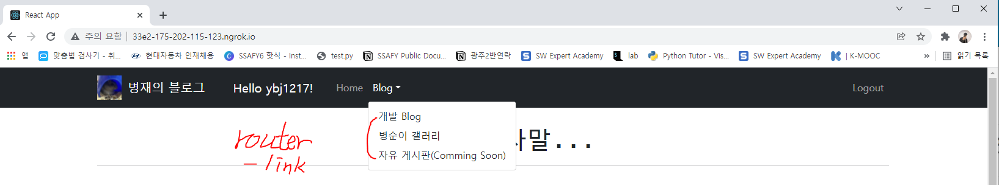
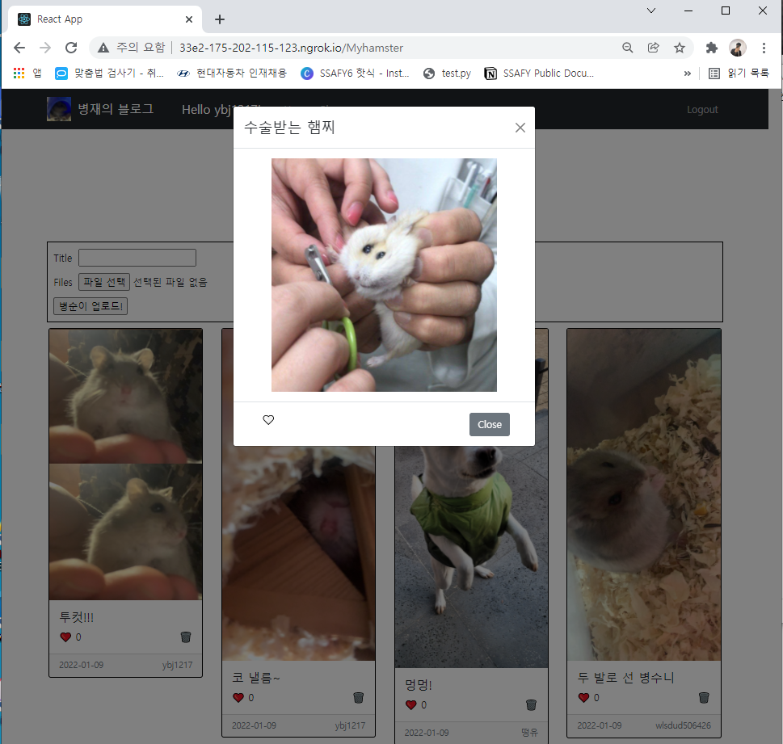
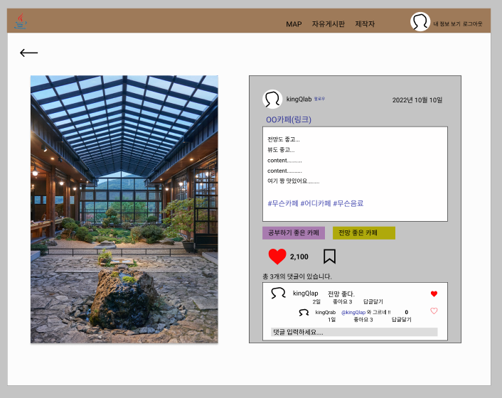

> ## ~ 01.10
>
> ## React(client)와 Django(server)를 이용한 개인 블로그 제작  [React 공부용]


## 1. react-router를 이용한 component link 구현.





```jsx
//client/src/App.js

import {BrowserRouter as Router, Route, Switch, Link} from 'react-router-dom'
// react-link 는 bootstrap Nav(자체적인 react link기능) 활용
import {Navbar, Container, Nav, NavDropdown} from 'react-bootstrap'

function App() {
  
  ...
  
  return (
    <div className="App">
      <header className="App-header">

        <Router>
        ...
            <Nav>
            	{/* State의 isLogin의 여부에 따라 content 표시 */}
                {
                  isLogin &&
                  <NavDropdown title="Blog" id="collasible-nav-dropdown">
                    <NavDropdown.Item href="/Community">개발 Blog</NavDropdown.Item>
                    <NavDropdown.Item href="/Myhamster">병순이 갤러리</NavDropdown.Item>
                    <NavDropdown.Item href="#">자유 게시판(Comming Soon)</NavDropdown.Item>
                  </NavDropdown>
                }
            </Nav>
            
            <Nav>
                {!isLogin && <Nav.Link href="/Login">Login</Nav.Link>}
                {!isLogin && <Nav.Link href="/Signup">Signup</Nav.Link>}
                {isLogin && <Nav.Link onClick={logout}>Logout</Nav.Link>}
            </Nav>
		...
          <Switch>
            <Route exact path="/"><Home/></Route>
            <Route path="/Community"><Community/></Route>
            <Route path="/Myhamster"><Hamster/></Route>
            <Route path="/Login"><Login loginCallBack={loginCallBack}/></Route>
            <Route path="/Signup"><Signup/></Route>
            <Route path="/CommunityNew"><CommunityNew/></Route>
            <Route path="/CommunityDetail/:pk" component={CommunityDetail}></Route>
          </Switch>
            
        </Router>
          
      </header>
    </div>
  );
}

export default App;

```


## 2. React-ckeditor를 활용한 게시판 글쓰기, 읽기, 미디어 업로드 구현.


##### client 에서 사진을 업로드하면,


##### media/uploads(hamster) 로 사진이 저장.


```jsx
//client/src/components/CommunityNew.js

import { CKEditor } from "@ckeditor/ckeditor5-react";
import ClassicEditor from "@ckeditor/ckeditor5-build-classic";

...

<CKEditor
            ...
    		onChange={(event, editor) => {
              ...
              // 에디터상 미리보기가 server측 상대경로로 저장되기 때문에, replace를 이용해 업로드한 					사진이 client측에서 보이게 함.
              const newData = data.replace(
                "src=\"/media",
                "src=\"http://ffe8-175-202-115-123.ngrok.io/media"
              );
			  ...
            }}
    		...
            config={{
              ckfinder: {
                uploadUrl: "http://ffe8-175-202-115-123.ngrok.io/ckeditor/upload/",
                options: {
                  resourceType: "Images",
                },
              },
            }}
/>
```


## 3. 좋아요 기능 구현.




```python
# server/hamster/views.py
...
@api_view(['POST'])
@permission_classes([AllowAny])
def like_user(request, hamster_pk):
    user_id = request.data['id']
    hamster = get_object_or_404(Hamster, pk=hamster_pk)
    likeUser = hamster.fans.all()
    if likeUser.filter(pk=user_id):
        hamster.fans.remove(user_id)
        liked = False
    else:
        hamster.fans.add(user_id)
        liked = True
    data = {
        'liked' : liked,
        'count' : hamster.fans.count()
    }
    return Response(data)
```


```jsx
//client/src/components/hamster.js

import axios from 'axios';
import jwt_decode from 'jwt-decode'

function Hamster() {
  ...
  const like = () => {
    const token = localStorage.getItem('jwt')
    var user = jwt_decode(token).user_id
    const url =  `http://ffe8-175-202-115-123.ngrok.io/hamster/like/${currentview}/`
    axios.post(url,{id:user},{headers:setToken()})
    .then(function(res){
      setIslike(res.data["liked"])
    })
  }
  ...
  return (
    <div className="Hamster">
      ...
      <Modal
        show={show}
        onHide={handleClose}
        backdrop="static"
        keyboard={false}>
        ...
        <Modal.Footer style={{display:'flex',justifyContent:'space-between'}}>
          <div>
            {islike && <p style={{cursor:"pointer", marginLeft:"30px"}} onClick={like}>❤</p>}
            {!islike && <p style={{cursor:"pointer", marginLeft:"30px"}} onClick={like}>🤍</p>}
          </div>
          <Button style={{marginRight:"30px"}} variant="secondary" onClick={handleClose}>Close</Button>
        </Modal.Footer>
      </Modal>
    </div>
  );
}

export default Hamster;

```


## 느낀점

#### 1. javascript 문법과 유사해 적응하는데 어렵지 않았다.

### 2. 하지만 막상 ngrok터널을 이용해 외부에서 돌려보니 속도측에서 아쉬웠고, 프론트와 백에서의 구현 최적화가 얼마나 중요한지 느꼈다. (지금까진 local에서만 돌려봐서 못느꼈는데  속도가 이렇게 느릴 줄 몰랐다.)

### 3. 리액트 hook을 자유자재로 사용할 수 있는 능력이 생길때까지 열심히 학습하겠다.


> ## 01.10
>
> ## 와이어프레임 제작 (figma)이용.





## 느낀점

### 1. 1학기때 프로젝트 할때는 이렇게 기획단계를 거친 적이 없었던거같다.

### 2. 기획단계를 거치며 프로젝트를 진행하면 해맬 일도 없을것같고, 모두가 명확한 한가지 목표를 두고 업무에 열중할 수 있을 것같다.


