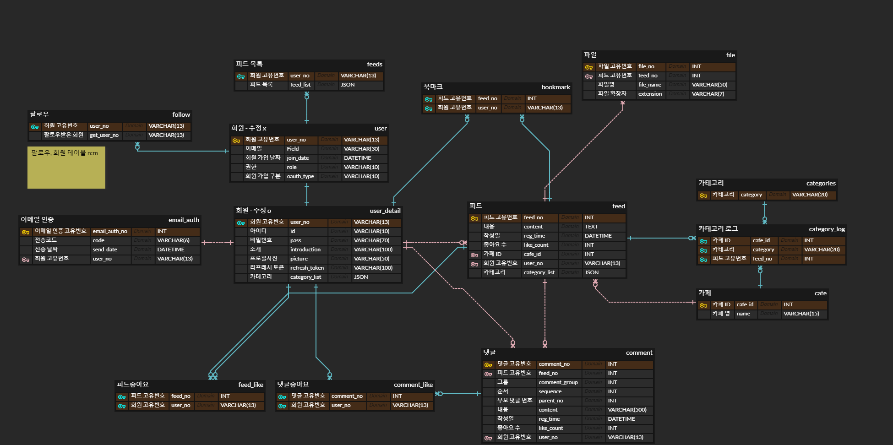

# 01/10

- ERD 초안 작성
  https://www.erdcloud.com/d/BqyD4bNpayfsJ7ijs

- 요구사항 설계
  일부 세부사항 수정

# 01/11

- 컨설턴트님, 코치님과 미팅 후 ERD 수정

- JPA 공부
  https://www.inflearn.com/course/ORM-JPA-Basic

# 01/12

- 과다 트래픽을 피하기 위한 정규화 시행(좋아요 테이블)

- Commit 규칙 정하기
  https://blog.ull.im/engineering/2019/03/10/logs-on-git.html

# 01/13

- ERD 완성
- 

- Mysql Json Data 공부
  https://www.lesstif.com/dbms/mysql-json-data-54952420.html

- Spirng Security 공부
  https://jeong-pro.tistory.com/205

- JWT 공부
  https://chanho0912.tistory.com/85
