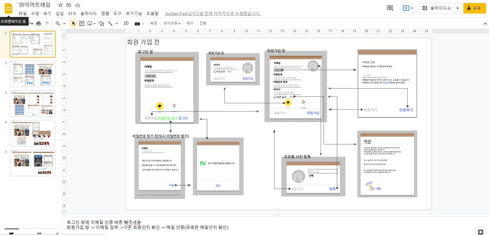
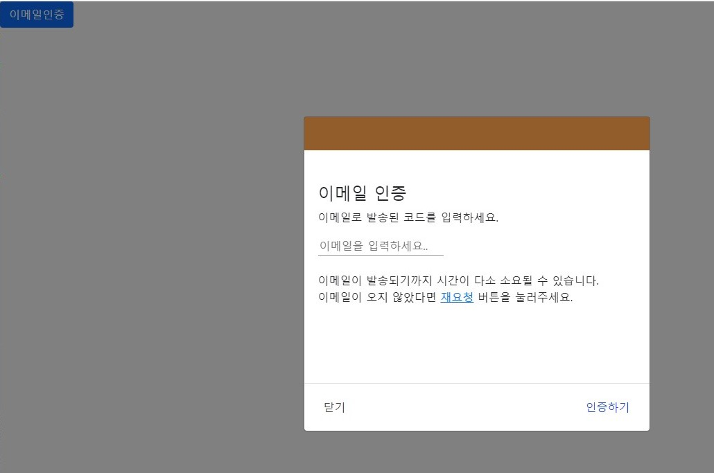
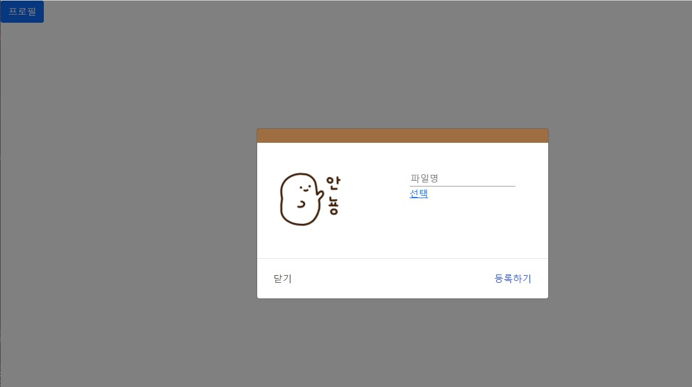
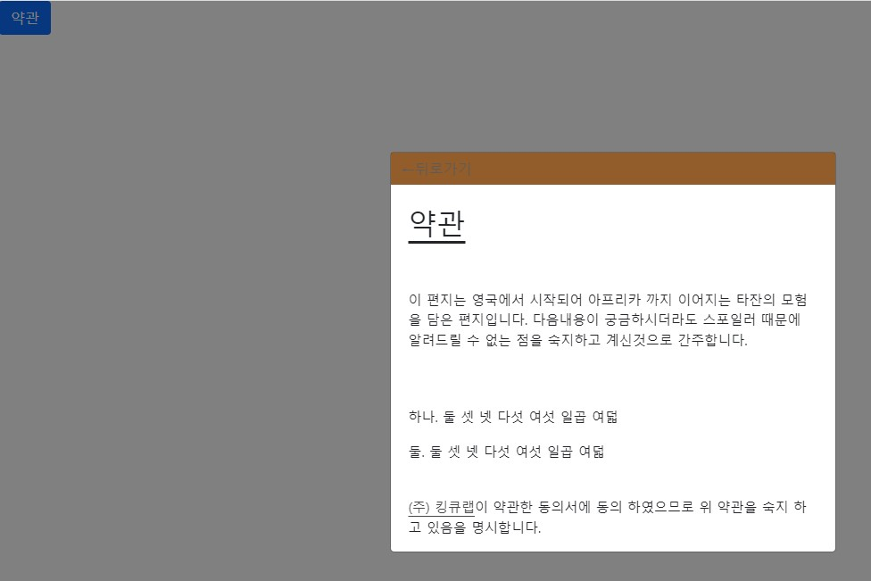
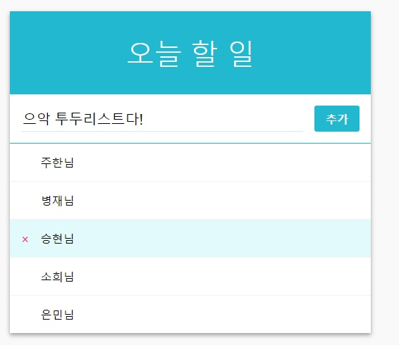

# 🦸‍♂️README

## 1. 주제선정

카페(디저트)  커뮤니티 기반 SNS 

인스타그램 + 지도

프로토 타입의 사진 제작


## 2. 와이어 프레임 제작




## 3. 와이어 프레임을 리액트로 연습

Email인증 부분만 간단히 코드를 올리고 다른부분은 사진으로 대체합니다.

`Email.css`

```react
.input {
  flex: 1;
  font-size: 1rem;
  outline: none;
  border: none;
  border-bottom: 1px solid #969696;
}
.h4 {
  margin-left: 3px;
  color: #484848;
}
#navcolor {
  border: 0;

  background-color: #864A13;
  opacity: 0.8;
}
#NoBgButton {
  background-color : white;
  border: none;
  color : #1E4DF6;
  font-weight:500;
}

#NoBgExit {
  margin-right: auto;
  background-color : white;
  border: none;
  color : #484848;
  font-weight:500;
}
#ModalPadding {
  padding : 0;
}

#EmailMarginLeft {
  margin-left : 20px;
}
```

`EmailForm.js`

```react
import { Form, Button } from "react-bootstrap";
import './Email.css'

const AddForm = () => {
  
  return (
      <Form>
        <div id="navcolor">
          <br></br>
          <br></br>
        </div>
        <br></br>
        <br></br>
        <h4 id="EmailMarginLeft">이메일 인증</h4>
        <p id="EmailMarginLeft"> 이메일로 발송된 코드를 입력하세요.</p>
        <Form.Group>
          
          <input
          id ="EmailMarginLeft"
          className="input"
          type="email"
          name="email"
          placeholder="이메일을 입력하세요.."
          />
        <br></br>
        <br></br>
        <a id ="EmailMarginLeft"> 이메일이 발송되기까지 시간이 다소 소요될 수 있습니다.</a>
        <p id ="EmailMarginLeft"> 이메일이 오지 않았다면 <a href="#">재요청</a> 버튼을 눌러주세요.</p>
        <br></br>
        <br></br>
        <br></br>
        <br></br> 
        </Form.Group>
        </Form>
  )
}
export default AddForm;
```

`EmailModal.js`

```react
import { buildQueries } from '@testing-library/react';
import React from 'react';
import  { Modal, Button } from 'react-bootstrap';
import AddForm from './EmailForm';

const EmailModal = ( { show, onHide }) => {
  return (
    <Modal
      show = {show}
      onHide = {onHide}
      aria-labelledby="contained-modal-title-vcenter"
      dialogClassName="modal-w"
      centered
    >
      
       
      
      <Modal.Body id = "ModalPadding">
        <AddForm />
      </Modal.Body>
      <Modal.Footer>
        <Button id="NoBgExit" variant="secondary" onClick={onHide}>닫기</Button>
        <Button id="NoBgButton" onClick={onHide}>인증하기</Button>
      </Modal.Footer>
    </Modal>
  )
}

export default EmailModal
```







## 그 외 리액트 공부



